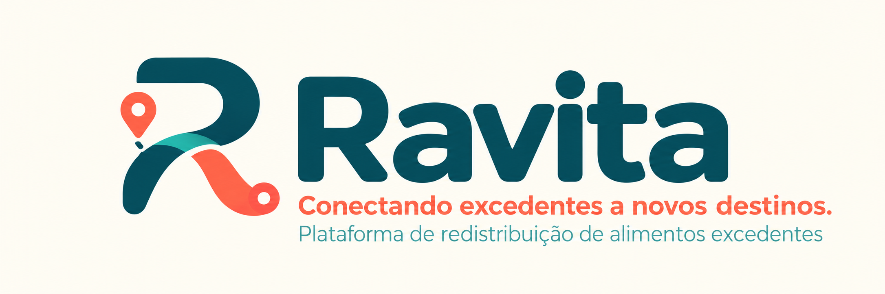
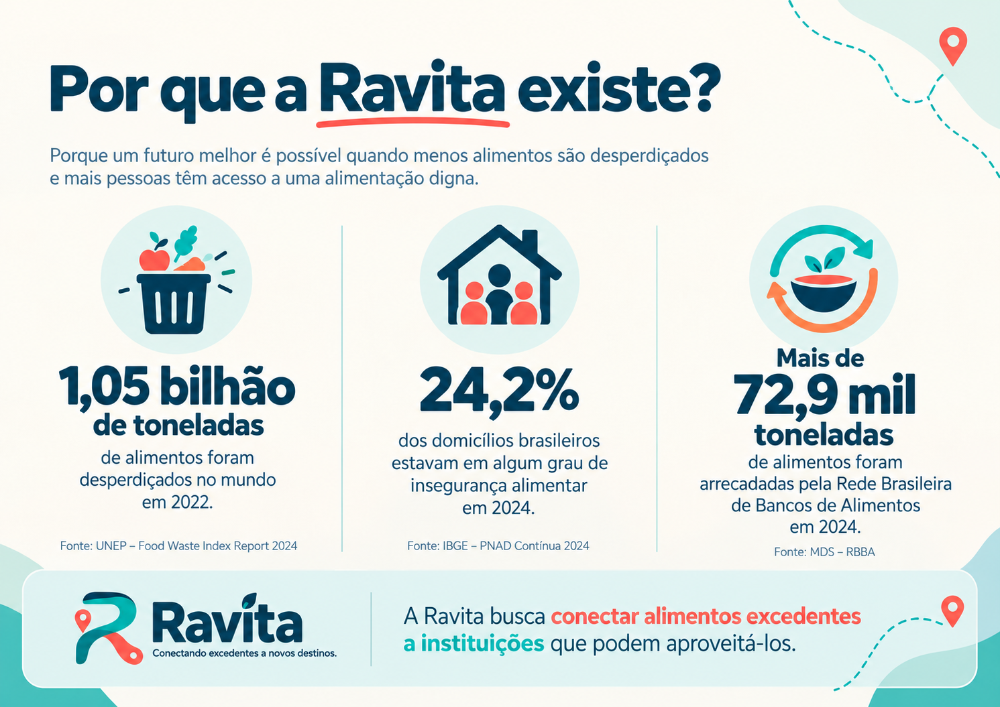
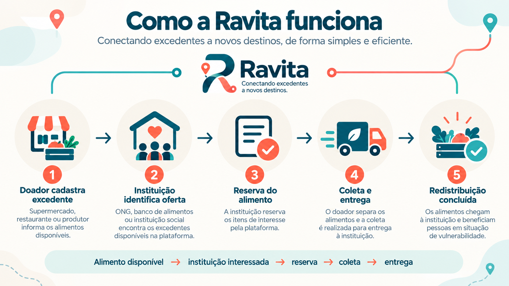

### Grupo: CodeSD
### Integrantes: Ana Cecília Andrade Araújo, Gabriel Santos Silva, Lucas Reis Silvino e Luis Felipe Silva Rezende.

# Ravita

**Conectando excedentes a novos destinos.**

A **Ravita** é uma plataforma digital voltada à redistribuição de alimentos excedentes ainda adequados ao consumo. A proposta é conectar estabelecimentos doadores, instituições beneficiárias e responsáveis pela logística, apoiando o processo desde a disponibilização do alimento até sua retirada e entrega.

---

## Sobre o nome

**Ravita** é uma palavra finlandesa associada ao ato de **nutrir e alimentar**.

O nome representa o propósito da plataforma: contribuir para que alimentos que perderam sua papel comercial, mas ainda estão adequados ao consumo possam encontrar um novo destino e continuar cumprindo sua função de nutrir.

> **Ravita — conectando excedentes a novos destinos.**

## Identidade visual

A identidade da Ravita utiliza principalmente:

- *azul-petróleo (#0F4C5C)*, como cor principal, associado a confiança, tecnologia, estabilidade e organização;
- *coral (#FF6B5B)*, como cor de destaque, associado a movimento, energia, proximidade e novos destinos;
- *turquesa (#2EC4B6)*, como cor complementar, associado a conexão, transformação e impacto positivo;
- *creme (#F2E9DB)*, como cor de fundo, associado a acolhimento, leveza e equilíbrio visual.
- elementos visuais relacionados a **circulação, alimento, conexão e redistribuição**.

---

## Por que a Ravita existe?

O desperdício de alimentos representa um problema de grande escala, com consequências sociais, econômicas e ambientais.

Segundo o **Food Waste Index Report 2024**, do Programa das Nações Unidas para o Meio Ambiente (UNEP), aproximadamente **1,05 bilhão de toneladas de alimentos foram desperdiçadas no mundo em 2022**, considerando domicílios, serviços de alimentação e varejo. Esse volume corresponde a aproximadamente **19% dos alimentos disponíveis aos consumidores** [1].

Ao mesmo tempo, o Brasil ainda enfrenta dificuldades relacionadas ao acesso regular e adequado à alimentação. Dados da **PNAD Contínua — Segurança Alimentar 2024**, do Instituto Brasileiro de Geografia e Estatística (IBGE), mostram que **24,2% dos domicílios brasileiros apresentavam algum grau de insegurança alimentar**, correspondendo a aproximadamente 18,9 milhões de domicílios [2].

A existência simultânea desses dois cenários não significa que a redistribuição de alimentos excedentes seja capaz de solucionar, isoladamente, a insegurança alimentar. Entretanto, evidencia a importância de iniciativas capazes de aumentar o aproveitamento de alimentos ainda adequados ao consumo humano.

No Brasil, a redistribuição de alimentos já acontece por meio de diferentes iniciativas. A **Rede Brasileira de Bancos de Alimentos (RBBA)** arrecadou **mais de 72,9 mil toneladas de alimentos em 2024**, demonstrando a existência de um ecossistema real envolvendo doadores, bancos de alimentos, instituições receptoras e beneficiários [3].

A relevância desse processo também é reconhecida pela legislação brasileira. A **Lei nº 15.224, de 30 de setembro de 2025**, instituiu a Política Nacional de Combate à Perda e ao Desperdício de Alimentos (PNCPDA). Entre seus princípios está o incentivo ao uso de soluções, como aplicativos e sites, capazes de aproximar aqueles que desejam doar daqueles que desejam receber alimentos [4].

## O problema

Disponibilizar um alimento para doação não significa necessariamente que ele será efetivamente redistribuído.

Para que isso aconteça, diferentes informações e participantes precisam ser coordenados:

- qual alimento está disponível;
- qual a quantidade;
- onde ele está localizado;
- até quando poderá ser retirado;
- qual instituição possui interesse;
- qual instituição possui capacidade para recebê-lo;
- como será realizada a coleta;
- como será realizada a entrega.

A literatura científica também aponta que operações de recuperação e redistribuição de alimentos envolvem desafios logísticos relacionados a diferentes pontos de coleta e entrega, capacidade dos veículos e **janelas de tempo para realização das operações** [5].

A perecibilidade de determinados alimentos torna essa coordenação ainda mais importante.

### Questão central

> **Como facilitar a conexão e a coordenação entre estabelecimentos que possuem alimentos excedentes, instituições que podem aproveitá-los e a logística necessária para que esses alimentos cheguem a um novo destino dentro do período disponível?**

É nesse contexto que surge a **Ravita**.

---

## Nossa proposta

A Ravita será uma plataforma digital que permitirá que estabelecimentos disponibilizem alimentos excedentes e que instituições interessadas encontrem oportunidades compatíveis com suas necessidades.

A proposta não é substituir bancos de alimentos ou iniciativas de redistribuição já existentes.

A Ravita busca atuar como uma ferramenta de **conexão, organização e acompanhamento** desse processo.

---

## Como a Ravita funciona?

O fluxo inicial da plataforma será:

### 1. Doador cadastra o excedente

Um supermercado, restaurante, produtor, distribuidor ou outro estabelecimento registra os alimentos disponíveis.

Entre as informações poderão estar:

- tipo de alimento;
- quantidade;
- localização;
- período disponível para retirada;
- informações necessárias para o recebimento.

### 2. Instituição identifica uma oferta

Instituições cadastradas poderão consultar os alimentos disponíveis e identificar ofertas compatíveis com suas necessidades.

### 3. Reserva do alimento

Quando uma instituição demonstrar interesse em determinada oferta, os alimentos poderão ser reservados.

A reserva evita que a mesma quantidade seja destinada simultaneamente a diferentes instituições.

### 4. Coleta e entrega

Após a reserva, será organizada a retirada dos alimentos e sua entrega à instituição beneficiária.

### 5. Redistribuição concluída

Quando os alimentos chegarem ao destino, a entrega será confirmada.

Dessa maneira, a plataforma consegue diferenciar:

**alimento disponibilizado**

de

**alimento efetivamente redistribuído.**

### Fluxo resumido

**Alimento disponível → instituição interessada → reserva → coleta → entrega → redistribuição concluída**

---

## Participantes

### Estabelecimentos doadores

Podem incluir:

- supermercados;
- restaurantes;
- produtores;
- distribuidores;
- outros estabelecimentos que possuam alimentos excedentes adequados à redistribuição.

### Instituições beneficiárias

Podem incluir:

- bancos de alimentos;
- organizações sociais;
- associações;
- outras instituições aptas a receber os alimentos.

### Responsáveis pela logística

Pessoas, organizações ou parceiros responsáveis pela retirada e entrega dos alimentos.

### Beneficiários indiretos

Pessoas atendidas pelas instituições que recebem os alimentos redistribuídos.

---

## Impacto social esperado

O impacto social esperado da Ravita está relacionado principalmente ao **aumento do aproveitamento de alimentos excedentes ainda adequados ao consumo** e ao apoio às instituições que atendem pessoas em situação de vulnerabilidade.

A Ravita não pretende resolver isoladamente problemas amplos como o desperdício de alimentos ou a insegurança alimentar.

Sua contribuição está em atuar sobre uma etapa específica:

**facilitar a conexão e a coordenação entre alimentos disponíveis, instituições interessadas em recebê-los e a logística necessária para realizar a redistribuição.**
Entre os impactos esperados estão:

- aumento do aproveitamento dos alimentos disponibilizados;
- redução do tempo necessário para encontrar um novo destino;
- maior conexão entre estabelecimentos e instituições;
- melhor organização das retiradas e entregas;
- geração de dados sobre as redistribuições realizadas;
- apoio às instituições que atendem pessoas em situação de vulnerabilidade.

---

## Como o impacto será medido?

Entre os indicadores previstos estão:

- quantidade de alimentos disponibilizados;
- quantidade de alimentos efetivamente redistribuídos;
- percentual das ofertas aproveitadas;
- número de estabelecimentos doadores;
- número de instituições atendidas;
- número de redistribuições iniciadas;
- número de redistribuições concluídas;
- número de redistribuições canceladas;
- tempo médio entre publicação e reserva;
- tempo médio entre publicação e retirada;
- quantidade média de alimentos por redistribuição;
- estimativa de pessoas atendidas pelas instituições beneficiárias.

### Indicador principal

Um dos principais indicadores será o:

**Percentual de aproveitamento das ofertas**

Ou seja:

> **Dos alimentos disponibilizados na Ravita, quantos efetivamente chegaram a um novo destino?**

O simples número de ofertas cadastradas não demonstra que houve redistribuição. Por isso, a plataforma priorizará indicadores associados às operações efetivamente concluídas.

---

## Quem será beneficiado?

### Instituições sociais e bancos de alimentos

Serão beneficiados diretamente ao terem maior visibilidade sobre alimentos disponíveis e uma forma estruturada de organizar seu recebimento.

### Estabelecimentos doadores

Supermercados, restaurantes, produtores, distribuidores e outros estabelecimentos terão um canal estruturado para disponibilizar seus excedentes e acompanhar sua destinação.

### Pessoas atendidas pelas instituições

São os principais beneficiários indiretos da plataforma.

O aumento da quantidade de alimentos redistribuídos poderá ampliar os recursos disponíveis para as organizações que atendem essas pessoas.

### Responsáveis pela logística

Poderão utilizar informações centralizadas sobre retiradas e entregas que precisam ser realizadas.

---

## Limites da solução

A Ravita **não será responsável por determinar se determinado alimento está ou não adequado ao consumo**.

A legislação estabelece condições e responsabilidades relacionadas à doação de alimentos [4].

As responsabilidades sanitárias e o cumprimento das normas aplicáveis continuarão sendo dos participantes envolvidos no processo.

O papel da Ravita será:

**conectar → organizar → acompanhar.**

---

## Disciplina

**GCC129 — Sistemas Distribuídos — 2026/2**

Trabalho Prático: Startup de Sistema Distribuído.

---

## Status do projeto

### Parte 1 — Concepção e Pitch

Nesta etapa estão sendo desenvolvidos:

- identidade da startup;
- definição do problema;
- fundamentação por referências;
- impacto social esperado;
- proposta inicial da solução;
- organização do repositório.

---

## Execução

### Documentação de arquitetura

- [01. Arquitetura e decomposição em microsserviços](./docs/arquitetura/01-arquitetura-microsserviços.md)
- [02. API REST, versionamento, HATEOAS, API Gateway e BFFs](./docs/arquitetura/02-rest-gateway-bff.md)
- [Catálogo de contratos REST dos serviços e BFFs](./docs/arquitetura/02-contratos-rest.md)

### Implementação

O sistema ainda se encontra na etapa de concepção.

As instruções completas para execução serão adicionadas durante as próximas etapas, conforme o sistema começar a ser implementado.

---

# Referências

**[1] UNEP — UNITED NATIONS ENVIRONMENT PROGRAMME.** *Food Waste Index Report 2024*. Nairobi: United Nations Environment Programme, 2024.

Utilizada para fundamentar a dimensão global do desperdício de alimentos, incluindo a estimativa de aproximadamente 1,05 bilhão de toneladas desperdiçadas em 2022.

---

**[2] IBGE — INSTITUTO BRASILEIRO DE GEOGRAFIA E ESTATÍSTICA.** *Pesquisa Nacional por Amostra de Domicílios Contínua: Segurança Alimentar 2024*. Rio de Janeiro: IBGE, 2025.

Utilizada para contextualizar a situação brasileira de insegurança alimentar, incluindo o percentual de 24,2% dos domicílios em algum grau de insegurança alimentar em 2024.

---

**[3] BRASIL. Ministério do Desenvolvimento e Assistência Social, Família e Combate à Fome — MDS.** *Rede Brasileira de Bancos de Alimentos — RBBA*. Brasília, DF.

Utilizada para demonstrar que a redistribuição de alimentos já ocorre em escala significativa no Brasil e que existe um ecossistema estruturado de bancos de alimentos, doadores, instituições receptoras e beneficiários.

---

**[4] BRASIL.** Lei nº 15.224, de 30 de setembro de 2025. Institui a **Política Nacional de Combate à Perda e ao Desperdício de Alimentos (PNCPDA)**. Brasília, DF, 2025.

Utilizada como fundamentação legal para iniciativas de combate ao desperdício e para o uso de soluções digitais que aproximem potenciais doadores e receptores de alimentos.

---

**[5] DUBEY, Nistha; TANKSALE, Ajinkya.** *A multi-depot vehicle routing problem with time windows, split pickup and split delivery for surplus food recovery and redistribution*. Expert Systems with Applications, 2023. DOI: **10.1016/j.eswa.2023.120807**.

Utilizada para fundamentar os desafios logísticos envolvidos na recuperação e redistribuição de alimentos excedentes, incluindo pontos de coleta e entrega, capacidade de transporte e janelas de tempo.

---

# Ravita

### **Conectando excedentes a novos destinos.**

> **Um alimento que perdeu seu destino comercial não necessariamente perdeu sua capacidade de nutrir.**
