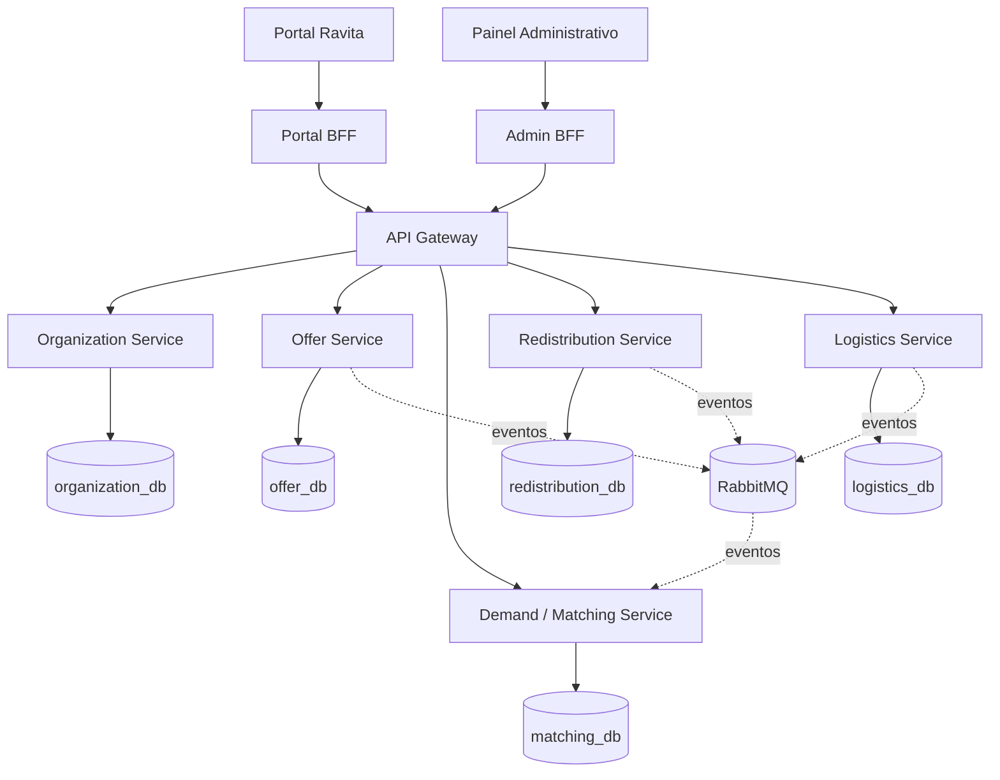

## 01. Arquitetura e Decomposição em Microsserviços
## 1. Objetivo

Este documento define a arquitetura geral da Ravita e as fronteiras dos microsserviços de domínio.

A decomposição parte do fluxo principal do produto:

**alimento disponível → instituição interessada → reserva → coleta → entrega → redistribuição concluída**

A proposta busca atender aos requisitos da disciplina sem criar microsserviços artificiais apenas para aumentar a quantidade de componentes.

---

## 2. Visão geral

A Ravita será composta por cinco microsserviços de domínio:

1. **Organization Service**
2. **Offer Service**
3. **Demand/Matching Service**
4. **Redistribution Service**
5. **Logistics Service**

Também existirão:

- Portal BFF;
- Admin BFF;
- API Gateway;
- RabbitMQ como broker de eventos;
- bancos PostgreSQL separados por microsserviço.



---

## 3. Organization Service

### Responsabilidade

Gerenciar as organizações participantes da Ravita.

Inclui:

- estabelecimentos doadores;
- instituições beneficiárias;
- dados cadastrais;
- endereços;
- contatos;
- tipo da organização;
- status;
- perfil/capacidade de recebimento.

### Pergunta de domínio

> Quem participa da Ravita e quais são suas características?

### Justificativa da fronteira

Doadores e instituições permanecem no mesmo serviço porque ambos são organizações participantes e compartilham grande parte das informações cadastrais.

Separar `Donor Service` e `Institution Service` neste momento aumentaria a fragmentação sem representar uma separação de domínio suficientemente forte.

### Banco

`organization_db`

Nenhum outro serviço poderá consultar ou alterar esse banco diretamente.

---

## 4. Offer Service

### Responsabilidade

Gerenciar os alimentos excedentes disponibilizados pelos doadores.

### Dados principais

- identificador da oferta;
- identificador do doador;
- categoria/tipo do alimento;
- quantidade;
- unidade;
- local de retirada;
- início da disponibilidade;
- limite para retirada;
- status.

### Estados iniciais

```text
AVAILABLE → RESERVED → COLLECTED → COMPLETED
```

Estados alternativos:

```text
CANCELLED
EXPIRED
```

### Pergunta de domínio

> Qual alimento está disponível e ele ainda pode ser reservado?

O Offer Service será o único responsável por alterar a disponibilidade da oferta.

### Banco

`offer_db`

---

## 5. Demand/Matching Service

### Responsabilidade

Gerenciar necessidades das instituições e identificar ofertas potencialmente compatíveis.

### Critérios iniciais

- categoria do alimento;
- quantidade;
- região;
- período;
- capacidade de recebimento;
- disponibilidade da oferta.

### Pergunta de domínio

> Quais ofertas podem atender determinada necessidade?

### Decisão importante

O Matching **não reserva alimentos**.

Ele apenas identifica compatibilidade. A efetivação da redistribuição pertence ao Redistribution Service.

Essa separação diferencia:

- descoberta de oportunidade;
- execução da transação de redistribuição.

### Banco

`matching_db`

---

## 6. Redistribution Service

### Responsabilidade

Gerenciar uma redistribuição concreta entre uma oferta e uma instituição.

Uma redistribuição referencia:

- oferta;
- instituição;
- operação logística;
- estado do processo.

### Estados previstos

```text
CREATED
OFFER_RESERVED
LOGISTICS_PENDING
IN_TRANSIT
DELIVERED
COMPLETED
FAILED
CANCELLED
```

### Pergunta de domínio

> Qual é o estado da redistribuição e quais etapas ainda precisam ocorrer?

### Papel arquitetural

Esse serviço será o **orquestrador da SAGA** principal da Ravita.

Ele coordena ações entre serviços sem acessar diretamente os bancos dos demais.

### Banco

`redistribution_db`

---

## 7. Logistics Service

### Responsabilidade

Gerenciar retirada, transporte e entrega dos alimentos.

### Informações principais

- local de retirada;
- local de entrega;
- janela de coleta;
- responsável pela operação;
- horário programado;
- status da coleta;
- status da entrega.

### Estados previstos

```text
PENDING → SCHEDULED → COLLECTED → IN_TRANSIT → DELIVERED
```

Estados alternativos:

```text
FAILED
CANCELLED
```

### Pergunta de domínio

> Como e quando o alimento chegará ao destino?

### Banco

`logistics_db`

---

## 8. Justificativa da decomposição

| Serviço | Responsabilidade principal |
|---|---|
| Organization | Quem participa? |
| Offer | O que está disponível? |
| Demand/Matching | Quem precisa e o que é compatível? |
| Redistribution | Qual redistribuição está acontecendo? |
| Logistics | Como o alimento chega ao destino? |

A decomposição busca manter responsabilidades claras sem transformar funcionalidades pequenas em serviços independentes sem necessidade.

---

## 9. Comunicação entre os serviços

### Síncrona — REST

Utilizada quando o solicitante precisa de resposta imediata.

Exemplos:

- validar organização;
- reservar oferta;
- consultar operação logística.

### Assíncrona — RabbitMQ

Utilizada para eventos de domínio.

Eventos previstos:

- `OfferCreated`;
- `OfferReserved`;
- `OfferReleased`;
- `OfferExpired`;
- `RedistributionCreated`;
- `RedistributionCancelled`;
- `RedistributionCompleted`;
- `PickupScheduled`;
- `FoodCollected`;
- `FoodDelivered`.

---

## 10. Decisões arquiteturais iniciais

### PostgreSQL por serviço

Será utilizada uma instância/container PostgreSQL independente por microsserviço para reduzir complexidade operacional e preservar propriedade exclusiva do dado.

### RabbitMQ

Escolhido como proposta de broker por oferecer:

- filas e exchanges simples;
- retries;
- dead-letter queues;
- boa integração com Docker e Kubernetes;
- complexidade adequada ao escopo acadêmico.

### SAGA

SAGA **orquestrada** pelo Redistribution Service.

### CQRS

Aplicado no Offer Service.

### Transactional Outbox

Aplicado inicialmente no Offer Service.

---

## 11. Resumo

A arquitetura proposta possui cinco microsserviços de domínio, banco independente por serviço, comunicação REST para interações síncronas e RabbitMQ para eventos.

Os demais documentos detalham API/Gateway/BFF, dados/Outbox/CQRS e SAGA.

---

## Checklist antes do commit

- [ ] O grupo revisou os cinco microsserviços.
- [ ] As fronteiras foram aprovadas.
- [ ] PostgreSQL por serviço foi aprovado.
- [ ] RabbitMQ foi aprovado.
- [ ] SAGA orquestrada foi aprovada.
- [ ] O diagrama Mermaid renderiza corretamente no GitHub.
