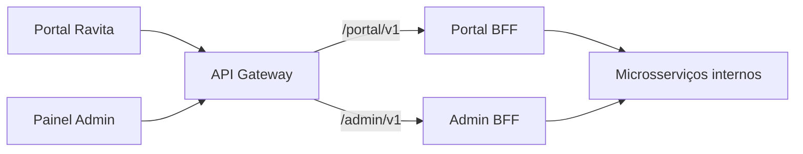

# Ravita — Parte 2
## 02. API REST, Versionamento, HATEOAS, API Gateway e BFFs

Documento complementar à [arquitetura de microsserviços](./01-arquitetura-microsserviços.md).

O [catálogo completo de contratos REST](./02-contratos-rest.md) detalha campos, validações, cabeçalhos, respostas e permissões de cada endpoint. Este documento apresenta decisões e exemplos resumidos; o catálogo complementa os exemplos com todos os campos obrigatórios e é a referência para os formatos de entrada e saída.

---

## 1. Objetivo

Definir os contratos REST iniciais, a estratégia de versionamento, um caso de HATEOAS, o API Gateway e os dois Backend for Frontend.

Os contratos são uma proposta para implementação futura. `/api/v1` identifica as APIs internas dos serviços de domínio; clientes externos acessam `/portal/v1` ou `/admin/v1` pelo Gateway. Os BFFs adaptam e agregam essas APIs sem assumir regras de negócio.

---

## 2. Versionamento

A Ravita utilizará versionamento por URI:

```text
/api/v1/...
```

Exemplo:

```http
GET /api/v1/offers
```

### Justificativa

- fácil identificação da versão;
- contratos previsíveis;
- facilita testes e documentação;
- permite manter versões incompatíveis durante migração.

Uma nova versão será criada apenas quando houver quebra incompatível de contrato.

Os BFFs também utilizam versionamento por URI (`/portal/v1` e `/admin/v1`). A inclusão de campos opcionais preserva a versão; remover campos ou alterar seu significado exige uma nova versão. Versões anteriores terão um período de migração comunicado aos consumidores.

---

## 3. Convenções REST

### Recursos

```text
/organizations
/offers
/demands
/redistributions
/logistics
```

### Métodos

- `GET`: consulta;
- `POST`: criação ou comando que gera um novo sub-recurso;
- `PATCH`: atualização parcial;
- `DELETE`: remoção/cancelamento quando semanticamente apropriado.

### Códigos principais

| Código | Uso |
|---|---|
| 200 | Operação concluída |
| 201 | Recurso criado |
| 202 | Processo distribuído aceito e ainda em andamento |
| 204 | Sucesso sem corpo |
| 400 | Requisição inválida |
| 401 | Não autenticado |
| 403 | Sem permissão |
| 404 | Recurso inexistente |
| 409 | Conflito de estado |
| 422 | Regra de negócio inválida |
| 500 | Falha inesperada |

### Formato e regras comuns

- Requisições e respostas com corpo usam `application/json`.
- Identificadores são strings opacas; datas e horários incluem fuso horário, como nos exemplos.
- Criações síncronas retornam `201` e `Location` com a URI do recurso. Respostas `204` não possuem corpo.
- Listagens usam `page` (a partir de 1) e `size` (padrão 20, máximo 100), retornando `items`, `page`, `size` e `total`.
- `PATCH` aceita apenas campos editáveis do recurso. Estados de reserva, redistribuição e entrega mudam pelas operações de domínio, nunca por alteração arbitrária de `status`.
- Falhas retornam `code`, `message` e `correlationId`, sem detalhes internos de implementação.
- O Gateway propaga `X-Correlation-ID`, gerando um identificador quando necessário. Serviços e BFFs preservam o identificador nas chamadas subsequentes.
- Limites de requisição retornam `429`; indisponibilidade temporária de dependências retorna `503`. Um BFF não representa falha de consulta como lista vazia ou indicador igual a zero.

Exemplo de erro:

```json
{
  "code": "OFFER_NOT_AVAILABLE",
  "message": "A oferta não está disponível para reserva.",
  "correlationId": "corr-999"
}
```

---

## 4. Organization Service

### Criar organização

```http
POST /api/v1/organizations
```

```json
{
  "name": "Mercado Central",
  "type": "DONOR",
  "document": "00000000000000",
  "address": {
    "city": "Lavras",
    "state": "MG"
  }
}
```

Resposta:

```http
201 Created
```

### Consultar

```http
GET /api/v1/organizations/{organizationId}
```

### Atualizar

```http
PATCH /api/v1/organizations/{organizationId}
```

---

## 5. Offer Service

### Criar oferta

```http
POST /api/v1/offers
```

```json
{
  "donorId": "org-123",
  "foodCategory": "VEGETABLES",
  "description": "Hortaliças variadas",
  "quantity": 30,
  "unit": "KG",
  "availableFrom": "2026-10-20T13:00:00-03:00",
  "availableUntil": "2026-10-20T17:00:00-03:00"
}
```

Resposta:

```http
201 Created
```

### Consultar ofertas

```http
GET /api/v1/offers
```

Filtros:

```text
?status=AVAILABLE
?category=VEGETABLES
?city=Lavras
```

### Consultar uma oferta

```http
GET /api/v1/offers/{offerId}
```

### Atualizar

```http
PATCH /api/v1/offers/{offerId}
```

### Reservar

```http
POST /api/v1/offers/{offerId}/reservations
```

```json
{
  "redistributionId": "red-456"
}
```

Respostas possíveis:

```text
201 Created
409 Conflict
```

A reserva é uma operação interna solicitada pelo Redistribution Service durante a SAGA. O Offer Service verifica e altera a disponibilidade atomicamente: duas solicitações concorrentes não podem reservar a mesma oferta. No contrato inicial, a reserva abrange a oferta inteira. Matching e BFFs não criam reservas diretamente.

### Liberar reserva

```http
DELETE /api/v1/offers/{offerId}/reservations/{reservationId}
```

Retorna `204 No Content` quando a liberação é concluída. A compensação é solicitada pelo Redistribution Service; uma oferta cujo prazo terminou não volta a `AVAILABLE`, e uma coleta já realizada impede a liberação (`409`).

---

## 6. HATEOAS

O recurso `Offer` será o exemplo obrigatório de HATEOAS.

```json
{
  "id": "offer-123",
  "foodCategory": "VEGETABLES",
  "quantity": 30,
  "unit": "KG",
  "status": "AVAILABLE",
  "_links": {
    "self": {
      "href": "/api/v1/offers/offer-123"
    },
    "reserve": {
      "href": "/api/v1/offers/offer-123/reservations",
      "method": "POST"
    },
    "donor": {
      "href": "/api/v1/organizations/org-123"
    }
  }
}
```

Quando a oferta estiver `RESERVED`, o link `reserve` não será retornado.

O link também será omitido nos estados `COLLECTED`, `COMPLETED`, `CANCELLED` e `EXPIRED`. Os links consideram estado e permissão do consumidor; sua presença não substitui validações no servidor. O exemplo representa a API interna consumida pelo orquestrador. No Portal, o BFF adapta os links para rotas públicas e expõe a ação de iniciar redistribuição, sem expor a reserva interna.

### Justificativa

O cliente recebe, junto com o estado atual do recurso, as ações válidas naquele momento.

---

## 7. Demand/Matching Service

### Criar demanda

```http
POST /api/v1/demands
```

```json
{
  "institutionId": "org-789",
  "foodCategory": "VEGETABLES",
  "desiredQuantity": 20,
  "unit": "KG",
  "city": "Lavras"
}
```

### Consultar matches

```http
GET /api/v1/demands/{demandId}/matches
```

```json
{
  "demandId": "dem-10",
  "matches": [
    {
      "offerId": "offer-123",
      "compatibility": "HIGH"
    }
  ]
}
```

O Matching não cria reserva.

A criação da demanda retorna `201 Created`, `Location` e seu identificador. A consulta de matches retorna `200 OK`, inclusive quando `matches` estiver vazio. O resultado indica compatibilidade no momento da consulta e não garante disponibilidade futura.

---

## 8. Redistribution Service

### Iniciar redistribuição

```http
POST /api/v1/redistributions
```

```json
{
  "offerId": "offer-123",
  "institutionId": "org-789"
}
```

Como o comando inicia uma SAGA distribuída:

```http
202 Accepted
```

```json
{
  "id": "red-456",
  "status": "CREATED"
}
```

### Consultar

```http
GET /api/v1/redistributions/{redistributionId}
```

A resposta `202` inclui `Location: /api/v1/redistributions/red-456` para acompanhamento. Aceitação não significa que a reserva ou entrega foi concluída. O cliente consulta o recurso para acompanhar os estados definidos na parte 1, inclusive `FAILED` e `CANCELLED`.

### Cancelar

```http
POST /api/v1/redistributions/{redistributionId}/cancellation
```

Retorna `202 Accepted` quando o cancelamento distribuído é aceito e `409 Conflict` quando o estado não permite cancelar. As compensações pertencem à SAGA do Redistribution Service; o BFF apenas encaminha a solicitação.

---

## 9. Logistics Service

```http
POST /api/v1/logistics
GET  /api/v1/logistics/{logisticsId}
POST /api/v1/logistics/{logisticsId}/collection
POST /api/v1/logistics/{logisticsId}/delivery
POST /api/v1/logistics/{logisticsId}/cancellation
```

`POST /logistics` cria a operação interna com `redistributionId`, endereços de coleta e entrega e janela de coleta, retornando `201` com identificador e `Location`. `GET` retorna `200` com o estado atual. `collection` e `delivery` registram a ocorrência com `occurredAt` e retornam `200` com o estado atualizado; `cancellation` retorna `200` após cancelamento local. Transições incompatíveis retornam `409`. A confirmação de entrega gera o evento de domínio; não conclui diretamente a redistribuição no banco de outro serviço.

---

## 10. API Gateway

O Gateway será a única entrada externa.



### Responsabilidades

- autenticação;
- autorização de acesso às rotas;
- roteamento;
- rate limiting;
- correlation ID;
- logging básico.

### Não ficará no Gateway

- regra de negócio;
- reserva de oferta;
- matching;
- SAGA;
- regras logísticas.

---

## 11. Roteamento

| Rota externa | Destino |
|---|---|
| `/portal/v1/**` | Portal BFF |
| `/admin/v1/**` | Admin BFF |

Os serviços de domínio ficarão em rede interna.

Os BFFs também ficam na rede interna, acessíveis externamente somente pelo Gateway. As rotas `/api/v1/**` não são publicadas diretamente. O Gateway valida a identidade e o acesso à rota; os serviços verificam a autorização sobre cada recurso, como a propriedade de uma oferta. Identificadores enviados pelo cliente não comprovam sua identidade. Consultas administrativas exigem perfil administrativo; a área logística do mesmo painel exige permissões específicas e atribuição à operação, conforme o catálogo. Chamadas internas de reserva e compensação exigem identidade de serviço autorizada.

---

## 12. Portal BFF

Cliente utilizado por doadores e instituições.

### Doador

- criar oferta;
- listar próprias ofertas;
- acompanhar reservas;
- acompanhar redistribuições.

### Instituição

- visualizar ofertas;
- cadastrar demandas;
- visualizar matches;
- iniciar redistribuição;
- acompanhar entrega.

### Endpoints agregados

```http
GET /portal/v1/home
GET /portal/v1/offers
GET /portal/v1/offers/{id}
GET /portal/v1/my-offers
GET /portal/v1/demands
GET /portal/v1/redistributions/{id}
```

### Comandos encaminhados

```http
POST  /portal/v1/offers
PATCH /portal/v1/offers/{id}
POST  /portal/v1/demands
GET   /portal/v1/demands/{id}/matches
POST  /portal/v1/redistributions
POST  /portal/v1/redistributions/{id}/cancellation
```

O BFF preserva os códigos de sucesso e erro do domínio e adapta `Location` para a rota pública. A identidade autenticada delimita `my-offers`, demandas e redistribuições; o cliente não escolhe outra organização para obter acesso a seus dados.

| Consulta | Composição |
|---|---|
| `home` | Resumo das ofertas ou demandas e redistribuições da organização autenticada |
| `offers` | Offer Service, com filtros e paginação |
| `my-offers` | Offer Service, restrito ao doador autenticado |
| `demands` | Demand/Matching Service, restrito à instituição autenticada |
| `redistributions/{id}` | Redistribution Service + Offer Service + Logistics Service |

---

## 13. Admin BFF

Cliente administrativo da Ravita.

### Necessidades

- organizações;
- redistribuições em andamento;
- falhas;
- operações logísticas;
- indicadores;
- ofertas expiradas.

### Endpoints

```http
GET /admin/v1/dashboard
GET /admin/v1/organizations
GET /admin/v1/redistributions
GET /admin/v1/logistics/failures
GET /admin/v1/offers/expired
```

| Consulta | Composição |
|---|---|
| `dashboard` | Contagens de organizações, ofertas e redistribuições por estado |
| `organizations` | Organization Service |
| `redistributions` | Redistribution Service, com filtros de estado |
| `logistics/failures` | Logistics Service, filtrado por `FAILED` |
| `offers/expired` | Offer Service, filtrado por `EXPIRED` |

Para suportar essas telas, os contratos internos incluem `GET /api/v1/organizations`, `GET /api/v1/demands`, `GET /api/v1/redistributions` e `GET /api/v1/logistics`, com paginação e filtros pertinentes ao recurso (`institutionId`, `donorId` ou `status`). Indicadores devem considerar todos os resultados filtrados, não apenas a página carregada. Os BFFs consultam as APIs dos serviços, nunca seus bancos diretamente.

---

## 14. Diferença entre os BFFs

### Portal BFF

```json
{
  "id": "red-456",
  "status": "IN_TRANSIT",
  "offer": {
    "description": "Hortaliças variadas",
    "quantity": 30,
    "unit": "KG"
  },
  "delivery": {
    "status": "IN_TRANSIT",
    "estimatedArrival": "2026-10-20T16:30:00-03:00"
  }
}
```

### Admin BFF

```json
{
  "id": "red-456",
  "status": "IN_TRANSIT",
  "offerId": "offer-123",
  "donorId": "org-123",
  "institutionId": "org-789",
  "logisticsId": "log-321",
  "sagaState": "WAITING_DELIVERY",
  "lastEvent": "FoodCollected",
  "correlationId": "corr-999"
}
```

O Portal entrega informações orientadas à tarefa do usuário. O Admin entrega informações operacionais e de diagnóstico.

---

## 15. Regras propostas para implementação

Esta seção registra decisões de projeto propostas pelo Integrante 2, a pedido do responsável por esta documentação. Não são requisitos adicionais do professor nem representam aprovação dos demais integrantes. Elas complementam a arquitetura do documento 01 e devem orientar a revisão conjunta dos contratos, do CQRS e da SAGA antes da implementação.

### 15.1 Propriedade das regras e autorização

| Ator | Operações permitidas |
|---|---|
| Doador ativo | Criar ofertas, consultar suas operações e editar ou cancelar suas ofertas disponíveis |
| Instituição ativa | Consultar ofertas, criar e consultar suas demandas, consultar seus matches e solicitar redistribuição |
| Participante de uma redistribuição | Consultar seu acompanhamento e solicitar cancelamento antes da coleta |
| Administrador | Consultar organizações, indicadores e diagnósticos; permissões adicionais explícitas permitem gerenciar cadastros e agendar operações, sem forçar estados de negócio |
| Operador logístico autorizado | Registrar os marcos das operações atribuídas, pela área restrita do painel administrativo e contratos internos; utiliza o mesmo cliente Admin, com permissões distintas |
| Redistribution Service | Solicitar reserva, liberação e criação/cancelamento logístico como parte da SAGA |

A autenticação identifica usuário, organização e permissões. O Gateway valida o acesso à rota; cada serviço valida a ação e a relação do usuário com o recurso. Uma identidade de serviço não elimina a necessidade de preservar e validar o contexto do usuário em operações delegadas. Cabeçalhos de identidade enviados pelo cliente não são confiáveis.

Organization é a fonte dos dados cadastrais. No escopo inicial, o cadastro e a alteração cadastral são operações administrativas; autoinscrição não está prevista. A desativação impede novos negócios, mas não apaga históricos nem bloqueia compensações de processos existentes. Documentos e endereços completos não são incluídos em consultas genéricas de ofertas. Mudanças de endereço não alteram retroativamente os endereços registrados em uma operação logística.

### 15.2 Oferta, quantidade e janela de coleta

- Uma oferta representa um lote indivisível. A reserva contempla toda a quantidade; fracionamento fica fora da primeira versão.
- `quantity` deve ser positiva e representada com precisão decimal definida no contrato de dados, sem cálculos de quantidade com ponto flutuante binário. Não somar unidades diferentes nem converter unidades implicitamente.
- `availableFrom < availableUntil`. Os campos delimitam a janela de coleta, não a validade sanitária do alimento. A reserva pode ocorrer antes do início da janela, mas nunca a partir de `availableUntil`.
- A instituição precisa poder receber o lote inteiro. Uma sugestão de matching não dispensa a validação de capacidade e das condições de recebimento na SAGA.
- Identificador, doador e histórico são imutáveis. Descrição, categoria, quantidade, unidade, local e janela de coleta só podem ser alterados enquanto a oferta estiver `AVAILABLE`, ainda dentro do prazo de reserva.
- O Offer decide a disponibilidade a partir de seu modelo de escrita, considerando estado, prazo e reserva ativa. O modelo de leitura do CQRS não autoriza uma reserva.

| Estado do Offer | Alterações aceitas |
|---|---|
| `AVAILABLE` | Edição pelo dono; cancelamento pelo dono; reserva interna; expiração pelo prazo |
| `RESERVED` | Confirmação de coleta ou liberação coordenada pela SAGA |
| `COLLECTED` | Confirmação de conclusão a partir do resultado da redistribuição |
| `COMPLETED`, `CANCELLED`, `EXPIRED` | Consulta e auditoria; sem reabertura automática |

Cancelamento direto de oferta disponível usa `POST /api/v1/offers/{offerId}/cancellation`, exposto como `POST /portal/v1/offers/{id}/cancellation`. Retorna `200` com a oferta `CANCELLED`; uma repetição já concluída retorna o mesmo estado. Oferta reservada exige cancelamento da redistribuição; demais estados incompatíveis retornam `409`. Não excluir fisicamente ofertas para representar cancelamento.

### 15.3 Concorrência e edição

O Offer deve conferir disponibilidade e registrar a reserva na mesma transação local, com atualização condicional ou bloqueio e restrição que impeça mais de uma reserva ativa por oferta. Duas redistribuições podem ser aceitas para processamento, mas somente uma pode obter a reserva; a outra termina com falha de negócio registrada pelo orquestrador.

Edições e cancelamentos diretos usam a versão atual do recurso: a consulta interna retorna `ETag`, e o comando envia `If-Match`. Ausência da precondição retorna `428`; versão desatualizada retorna `412`. Quando o BFF transforma a representação, expõe a versão de escrita como `editVersion`, em vez de reutilizar o ETag de outro JSON; detalhes constam no catálogo. A verificação de versão e a alteração são atômicas, impedindo que uma edição sobrescreva uma reserva concorrente.

### 15.4 Repetição de comandos e timeout

Criações de organizações, ofertas, demandas, redistribuições e operações logísticas, além dos comandos de reserva, coleta, entrega e cancelamento, exigem `Idempotency-Key`. A chave identifica uma intenção do consumidor e é preservada pelo Gateway e pelos BFFs.

- O serviço responsável guarda chave, identidade do consumidor, operação, conteúdo normalizado e resultado de forma durável, junto à transação local.
- Mesma chave e mesmo conteúdo retornam o resultado original, sem gerar outro recurso ou evento. Mesma chave com conteúdo diferente retorna `409 IDEMPOTENCY_KEY_REUSED`.
- Após autenticar e autorizar o solicitante, uma repetição reconhecida retorna o resultado persistido antes de reavaliar `If-Match`; isso permite repetir um cancelamento concluído sem conflito com a versão que ele próprio alterou. Uma nova intenção continua exigindo a versão atual.
- Requisições simultâneas com a mesma chave são serializadas. Enquanto o resultado original ainda não estiver disponível, uma repetição retorna `409 REQUEST_IN_PROGRESS`; o cliente pode repetir posteriormente com a mesma chave.
- Para esta proposta acadêmica, o registro de deduplicação acompanha a retenção do recurso/histórico. Não expirar registros de processos pendentes. Qualquer política futura de limpeza precisa definir uma janela pública de repetição segura.
- Comandos internos da SAGA têm identificadores estáveis por etapa. Uma repetição de liberação não pode liberar uma reserva nova de outra redistribuição.
- Timeout significa resultado desconhecido, não falha de negócio confirmada. Consultar o andamento ou repetir com a mesma chave; nunca criar uma nova intenção automaticamente.

`DELETE` de uma reserva já liberada retorna `204` sem novo efeito, desde que o vínculo com a oferta e a redistribuição seja válido. Uma reserva desconhecida retorna `404`. `X-Correlation-ID` serve para rastreamento e não substitui a chave de idempotência.

### 15.5 Cancelamento, coleta e compensações

Antes da coleta, doador ou instituição participante podem solicitar cancelamento ao Redistribution. A resposta `202` significa apenas aceitação. O recurso mantém o estado de negócio e informa `cancellationStatus: PENDING`, `COMPLETED` ou `REJECTED`; esse campo é uma proposta de contrato complementar, sem criar um novo estado principal na arquitetura 01.

A sequência recomendada para o Integrante 4 detalhar é:

1. Persistir a intenção de cancelar e impedir novas etapas da mesma SAGA.
2. Resolver qualquer criação logística em andamento e cancelar a operação, se existente. Não liberar o alimento enquanto uma operação de coleta ainda puder ser criada ou continuar ativa.
3. Logistics arbitra coleta versus cancelamento em uma transação local. Se a coleta vencer, rejeita o cancelamento e a oferta permanece indisponível. Se o cancelamento vencer, rejeita registros posteriores de coleta.
4. Depois de confirmada a impossibilidade de coleta, liberar a reserva pelo Offer. Voltar a `AVAILABLE` somente se o prazo ainda permitir; caso contrário, passar a `EXPIRED`.
5. Marcar a redistribuição `CANCELLED` apenas após as compensações necessárias estarem confirmadas. Falhas transitórias mantêm o processo pendente, com novas tentativas e diagnóstico administrativo.

Se a coleta já for conhecida no momento do pedido, retornar `409 CANCELLATION_NOT_ALLOWED`. Se ela vencer a corrida após um `202`, a consulta posterior informa `cancellationStatus: REJECTED` e o motivo. Um cancelamento solicitado pelo doador não cancela permanentemente a oferta por si só; após a liberação, o doador pode cancelar a oferta disponível com a precondição de versão.

O vencimento de uma oferta reservada também exige coordenação com Logistics; um temporizador do Offer não pode simplesmente disponibilizar ou liberar o lote. Depois da coleta, falhas de transporte não devolvem automaticamente a oferta ao estoque disponível. O fluxo de resolução física e operacional deve ser definido na documentação de SAGA/Logistics; não é seguro fingir que uma entrega física pode ser desfeita por uma atualização no banco.

### 15.6 Consistência eventual, CQRS e eventos

Matching somente sugere ofertas. Resultados de busca podem ficar desatualizados; a API de comando revalida as condições. Após uma escrita, o cliente usa o recurso retornado e acompanha a URI em `Location`, sem interpretar ausência temporária numa listagem como perda da operação.

O Offer grava mudança de estado e evento na Outbox dentro da mesma transação PostgreSQL. Publicação RabbitMQ e consumo admitem duplicatas: eventos possuem `eventId`, `aggregateId`, `aggregateVersion` e `correlationId`; consumidores deduplicam e não fazem o estado regredir por mensagens antigas. A política de recuperação de lacunas e o limite aceitável de defasagem serão definidos pelo Integrante 3 no documento de CQRS/Outbox, não presumidos neste contrato.

Somente o serviço proprietário altera seu banco. O Redistribution coordena a SAGA, mas não altera diretamente disponibilidade no banco do Offer nem estados no banco de Logistics. Falhas de compensação precisam continuar visíveis e recuperáveis.

### 15.7 Respostas, links e erros

| Situação | Resposta |
|---|---|
| JSON inválido, parâmetro desconhecido ou obrigatório ausente | `400` |
| Credencial ausente ou inválida | `401` |
| Identidade autenticada sem permissão | `403` |
| Recurso inexistente; recurso privado fora do escopo do solicitante | `404`, evitando confirmar a existência de dados de outra organização |
| Estado incompatível, disputa por reserva ou chave reutilizada indevidamente | `409` com código de erro específico |
| Versão de edição desatualizada | `412` |
| Quantidade não positiva ou janela temporal inválida | `422` |
| Precondição de edição ausente | `428` |
| Limite de chamadas atingido | `429` com `Retry-After` |
| Dependência indisponível | `503` |
| Tempo limite ao aguardar serviço interno | `504`; o resultado de um comando pode continuar desconhecido |

Os serviços retornam códigos de erro estáveis e mensagens legíveis, sem stack traces, tokens ou dados privados. O Portal remove informações internas como `sagaState` e eventos de diagnóstico; o Admin só as expõe a usuários autorizados.

HATEOAS considera estado, prazo e permissão. `reserve` existe apenas na API interna para o orquestrador autorizado; o Portal oferece `start-redistribution` para a instituição elegível. Links de edição e cancelamento direto aparecem somente para o dono de oferta disponível. Links não garantem que a operação continuará válida: o servidor revalida ao receber o comando. Cada link deve apontar para um endpoint documentado, sem URLs internas expostas no Portal.

### 15.8 Responsabilidades do Gateway e dos BFFs

O fluxo proposto é `cliente → Gateway → BFF → serviço`. Gateway aplica autenticação, autorização de rota, limites e rastreamento; agregação específica de cliente pertence aos BFFs. Os serviços continuam responsáveis pela autorização de recurso e pelas regras de negócio.

Não repetir automaticamente comandos sem idempotência. Timeouts e limites devem ser configuráveis; valores operacionais serão medidos na implementação. Um BFF retorna erro se faltar uma dependência essencial, sem substituir falhas por totais zero. Dados opcionais ausentes devem ser identificados explicitamente, nunca apresentados como se a operação não existisse.

Listagens têm ordenação estável com desempate por identificador. Totais do dashboard vêm das consultas `statistics` dos serviços definidas no catálogo, não da contagem da página visível. Cada total inclui o instante de referência; não se promete um snapshot distribuído único. Indicadores de quantidade não misturam `KG`, `L` e unidades individuais.

### 15.9 Cenários de aceitação para a implementação futura

- Duas instituições tentam reservar a mesma oferta: somente uma reserva ativa é criada.
- Um usuário altera o identificador da organização na requisição: não obtém acesso aos dados ou comandos de outra organização.
- Uma resposta de criação se perde e o cliente repete a chave: recebe o mesmo recurso, sem duplicação.
- Coleta e cancelamento concorrem: apenas uma transição vence em Logistics; a oferta não é liberada após coleta.
- Uma reserva vence durante compensação: a oferta termina `EXPIRED`, sem voltar à lista de disponíveis.
- Uma edição usa versão anterior à reserva: não sobrescreve o estado atual.
- Um evento é entregue duas vezes ou fora de ordem: não duplica o efeito nem regride a projeção.
- Uma dependência falha: o BFF informa indisponibilidade, sem fabricar uma resposta de sucesso.
- O estado ou a permissão muda: os links HATEOAS correspondentes desaparecem na próxima representação.

### 15.10 Alinhamento necessário entre integrantes

| Responsável | Pontos a revisar antes de implementar |
|---|---|
| Integrante 1 | Posição do Gateway, perfis de acesso e preservação das fronteiras de serviço |
| Integrante 2 | Endpoints e schemas completos, erros, precondições, idempotência e links públicos |
| Integrante 3 | Restrições de unicidade, precisão de quantidades, Outbox, deduplicação e defasagem do CQRS |
| Integrante 4 | Ordem de compensação, corrida coleta/cancelamento, expiração de reservas e recuperação de falhas |

Estas decisões reduzem ambiguidades e riscos conhecidos; não garantem ausência de falhas futuras. O contrato completo e os documentos dos demais integrantes devem incorporar os acordos da revisão, sem tratar pendências como funcionalidades implementadas.

---

## Checklist de revisão

- [x] Versionamento por URI definido para serviços e BFFs.
- [x] Contratos alinhados às responsabilidades dos cinco serviços.
- [x] HATEOAS exemplificado em Offer, condicionado ao estado e à permissão.
- [x] Gateway sem regra de negócio e como única entrada externa.
- [x] Portal BFF e Admin BFF com necessidades e respostas distintas.
- [ ] Revisão e aprovação dos contratos pelo grupo.
- [x] Campos de entrada/saída, cabeçalhos, permissões e respostas por endpoint detalhados no catálogo complementar.
